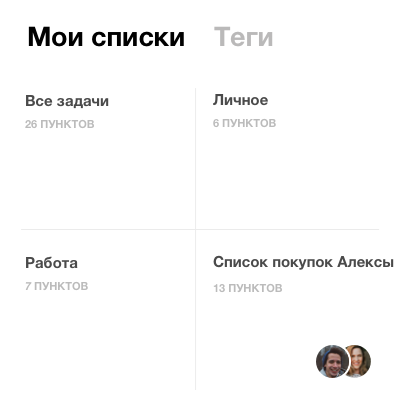
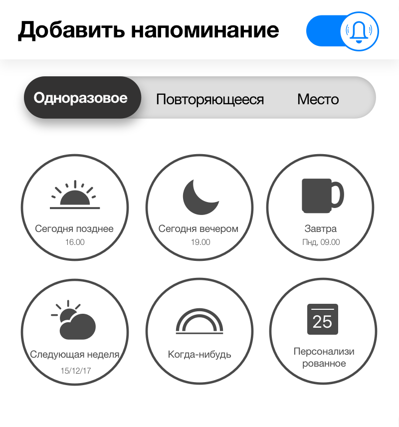
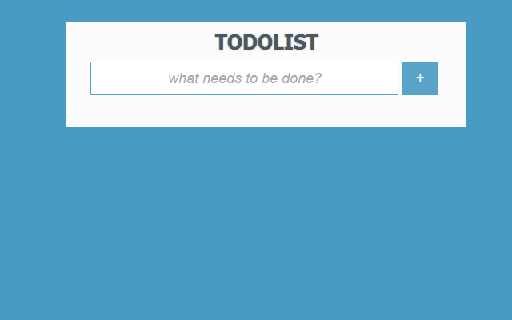
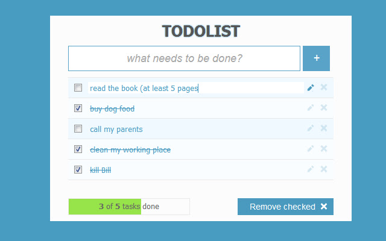

## Задание для To-Do list ##
:white_check_mark: Cтроки набор элементов
:black_square_button: Сделать выделение задачи, чтобы при выполнении оно исчезало
:black_square_button: Сделать текстовое окно для пополнения списка
:black_square_button: Добавить строку в текстовое поле (изменение параметра)
:black_square_button: Добавить фильтр для поиска
:black_square_button: Добавить поиск элементов

:-----:
[]

[]

[]

[]

[]

[]

